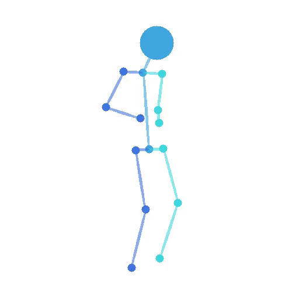
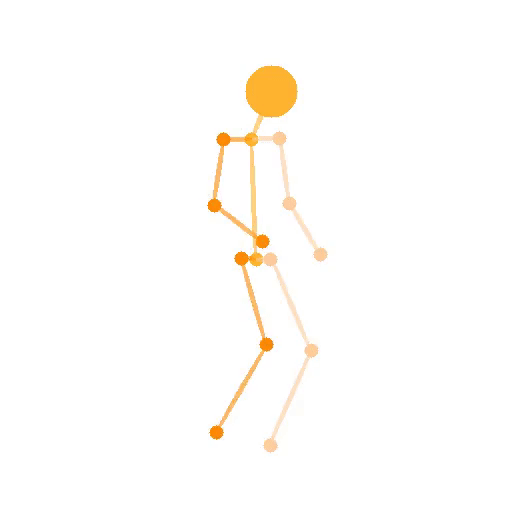
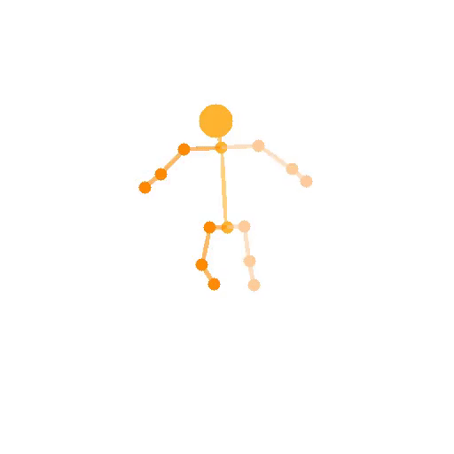
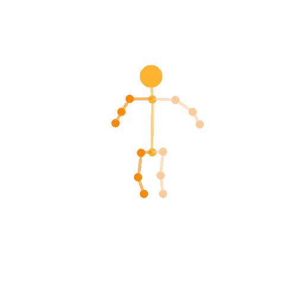

# MV-EQA: Exercise Quality Assessment in Monocular Video Streaming

This repository provides the PyTorch implementation of the core method proposed in **MV-EQA**. The release focuses on the main innovation of the paper: view-aware motion representation and retargeting for exercise quality assessment from monocular video streams.

The code includes the essential model components, pretrained weights, demo inputs, visualization utilities, and scripts for inference, jitter evaluation, and training.

## Visual Summary

### Motion Retargeting Demo

The demo combines motion, skeleton structure, and view-angle information from learner and teacher videos.

| Learner | Teacher | Retargeted Result |
| --- | --- | --- |
|  |  |  |

### Jitter Comparison

Compared with a previous 2D retargeting method, the released model produces more stable retargeted motion in real-time fitness scenarios.

| ViA2024 | Ours |
| --- | --- |
|  |  |

## Prerequisites

- Linux
- CPU or NVIDIA GPU with CUDA and CuDNN
- Python 3.8+
- PyTorch 2.0+

## Installation

Install Python dependencies:

```bash
pip install -r requirements.txt
```

## Run Demo Examples

We provide pretrained weights and several demo files. Run the inference script to generate learner, teacher, and retargeted videos:

```bash
python inference.py \
  --model_path ./model/pretrained_model.pth \
  -p1 ./demos/1_jump/input_npy_files/learner.npy \
  -p2 ./demos/1_jump/input_npy_files/teacher.npy \
  -h1 720 -w1 720 \
  -h2 720 -w2 720
```

Results are saved to `./examples` by default:

- `learner.mp4`
- `teacher.mp4`
- `retarget.mp4`

## Jitter Evaluation

Run the jitter evaluation script on the provided demo data:

```bash
python shake_evaluate.py --model_path ./model/pretrained_model.pth -g 0
```

The outputs are saved to `./examples/jitter` by default.

## Train From Scratch

Train the model on GPU:

```bash
python train.py -g 0
```

## Repository Structure

```text
MV-EQA/
  agent/                 training and evaluation agents
  dataset/               dataset loading utilities
  demos/                 demo inputs, rendered videos, and GIF summaries
  functional/            motion processing and visualization utilities
  mixamo_data/           normalization statistics
  model/                 network definitions and pretrained weights
  inference.py           demo inference entry point
  shake_evaluate.py      jitter evaluation entry point
  train.py               training entry point
  visualize.py           visualization helper
```

## Citation

If this code is useful for your research, please cite the MV-EQA paper:

[MV-EQA: Exercise Quality Assessment in Monocular Video Streaming](https://www.sciencedirect.com/science/article/abs/pii/S0952197626011875)
